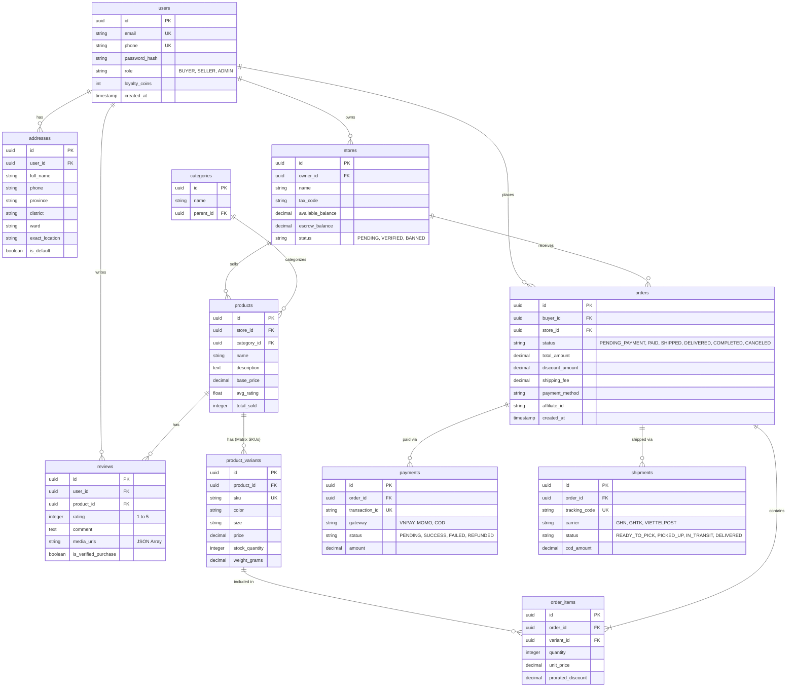

# Entity Relationship Diagram (ERD)

Lược đồ cơ sở dữ liệu quan hệ cho PomeloEC (Modular Monolith) sử dụng PostgreSQL.

```mermaid
erDiagram
    users ||--o{ addresses : "has"
    users ||--o{ stores : "owns"
    users ||--o{ orders : "places"
    users ||--o{ reviews : "writes"
    
    stores ||--o{ products : "sells"
    stores ||--o{ orders : "receives"
    
    products ||--o{ product_variants : "has (Matrix SKUs)"
    products ||--o{ reviews : "has"
    
    product_variants ||--o{ order_items : "included in"
    
    orders ||--|{ order_items : "contains"
    orders ||--o{ payments : "paid via"
    orders ||--o{ shipments : "shipped via"
    
    categories ||--o{ products : "categorizes"

    users {
        uuid id PK
        string email UK
        string phone UK
        string password_hash
        string role "BUYER, SELLER, ADMIN"
        int loyalty_coins
        timestamp created_at
    }

    stores {
        uuid id PK
        uuid owner_id FK
        string name
        string tax_code
        decimal available_balance
        decimal escrow_balance
        string status "PENDING, VERIFIED, BANNED"
    }

    addresses {
        uuid id PK
        uuid user_id FK
        string full_name
        string phone
        string province
        string district
        string ward
        string exact_location
        boolean is_default
    }

    products {
        uuid id PK
        uuid store_id FK
        uuid category_id FK
        string name
        text description
        decimal base_price
        float avg_rating
        integer total_sold
    }

    product_variants {
        uuid id PK
        uuid product_id FK
        string sku UK
        string color
        string size
        decimal price
        integer stock_quantity
        decimal weight_grams
    }

    categories {
        uuid id PK
        string name
        uuid parent_id FK
    }

    orders {
        uuid id PK
        uuid buyer_id FK
        uuid store_id FK
        string status "PENDING_PAYMENT, PAID, SHIPPED, DELIVERED, COMPLETED, CANCELED"
        decimal total_amount
        decimal discount_amount
        decimal shipping_fee
        string payment_method
        string affiliate_id
        timestamp created_at
    }

    order_items {
        uuid id PK
        uuid order_id FK
        uuid variant_id FK
        integer quantity
        decimal unit_price
        decimal prorated_discount
    }

    payments {
        uuid id PK
        uuid order_id FK
        string transaction_id UK
        string gateway "VNPAY, MOMO, COD"
        string status "PENDING, SUCCESS, FAILED, REFUNDED"
        decimal amount
    }

    shipments {
        uuid id PK
        uuid order_id FK
        string tracking_code UK
        string carrier "GHN, GHTK, VIETTELPOST"
        string status "READY_TO_PICK, PICKED_UP, IN_TRANSIT, DELIVERED"
        decimal cod_amount
    }

    reviews {
        uuid id PK
        uuid user_id FK
        uuid product_id FK
        integer rating "1 to 5"
        text comment
        string media_urls "JSON Array"
        boolean is_verified_purchase
    }
```
