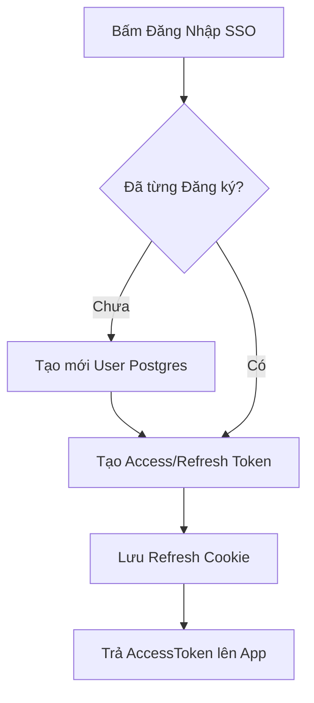
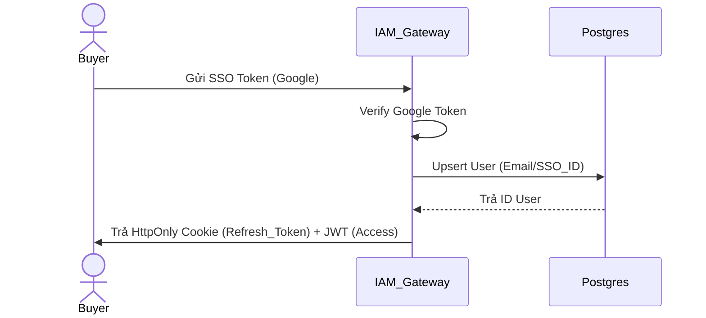
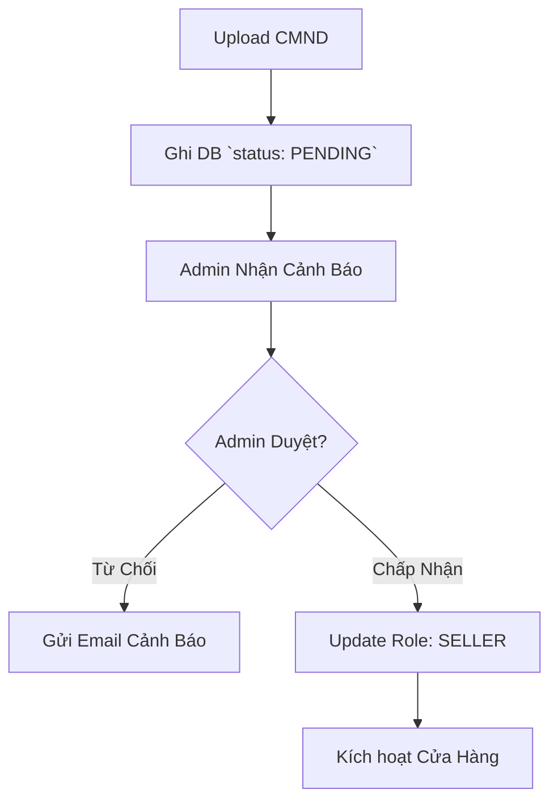
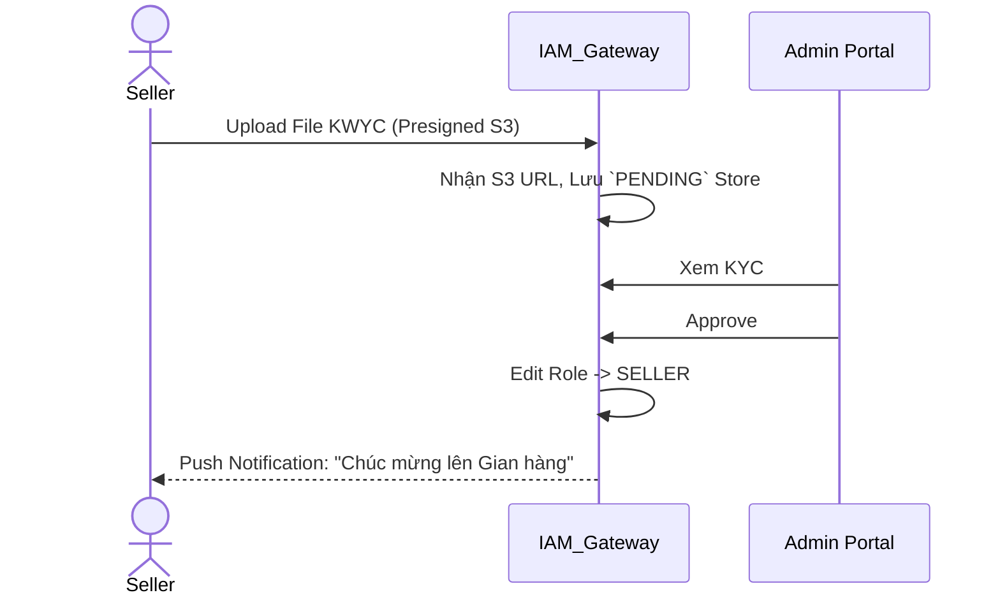
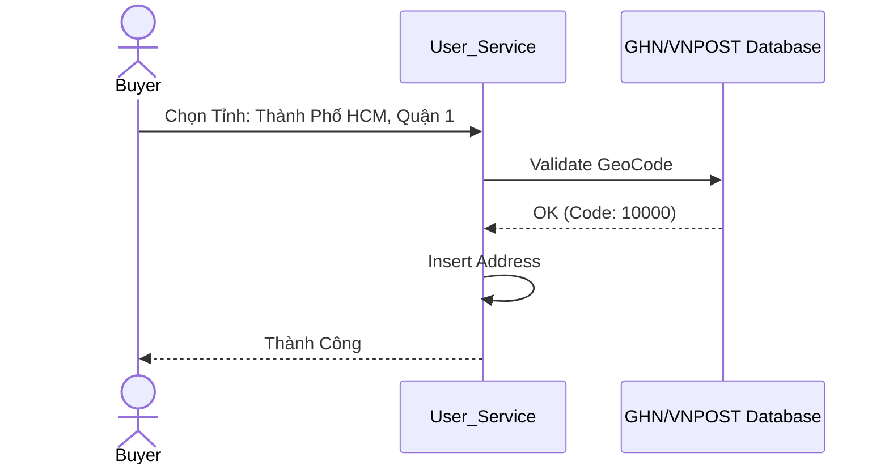

# Sequence & Activity - Nhóm 0: IAM

## UC-00A: Đăng nhập/Đăng ký SSO
**Activity Diagram**

**Sequence Diagram**


## UC-00B: Đăng ký KYC Gian Hàng
**Activity Diagram**

**Sequence Diagram**


## UC-00C: Quản lý Sổ Địa Chỉ
**Activity Diagram**
```mermaid
flowchart TD
    A[Nhập Tỉnh/Thành/Quận/Huyện] --> B{Phân cực GHN / ViettelPost?}
    B -- Valid --> C[Lưu Lat/Long (Nếu có GPS)] --> D[Thêm Address DB]
    B -- Invalid --> E[Báo lỗi địa chỉ]
```
**Sequence Diagram**

