# Sequence & Activity - Nhóm 1: Buyer

## UC-01: Tìm & Xem Chi tiết SP
**Activity Diagram**
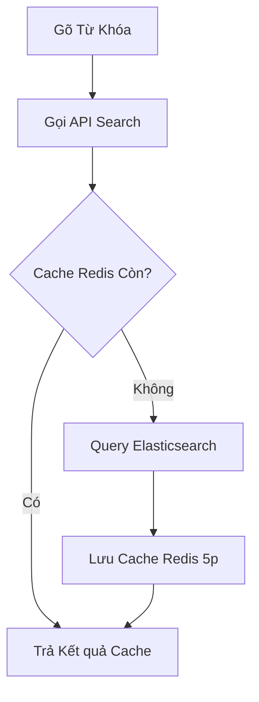
**Sequence Diagram**
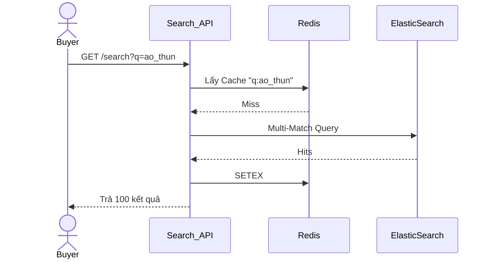

## UC-02: Thêm Giỏ Hàng & Tính Ship
**Activity Diagram**
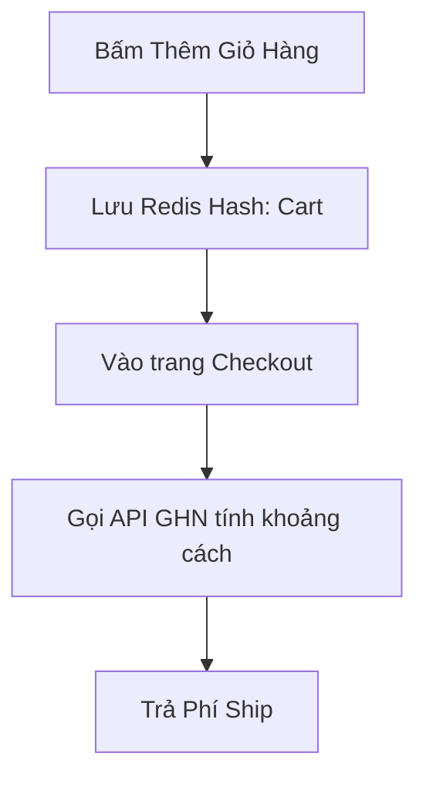
**Sequence Diagram**
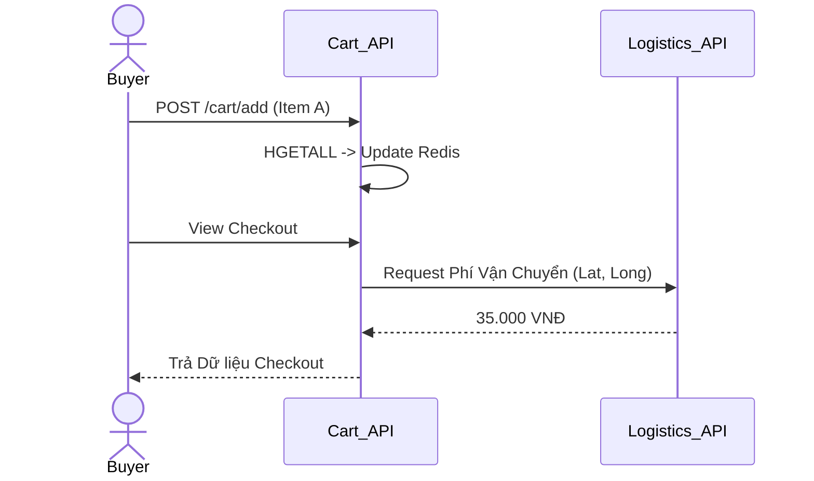

## UC-03 & UC-06: Mua Hàng & Áp Mã Giảm Giá
**Activity Diagram**
```mermaid
flowchart TD
    Start((Checkout)) --> GetCart[Lọc Giỏ Hàng & Tính Rule Voucher (UC06)]
    GetCart --> LuaRun[Gọi Lua Script (Khóa Kho + Khóa Lượt Voucher)]
    LuaRun --> CheckRes{Kết quả Lua?}
    CheckRes -- Fail --> Rollback[(Hết Hàng/Hết Code)]
    CheckRes -- OK --> OpenTx[Transaction SQL]
    OpenTx --> GhiDB[Lưu Orders & Items Rate]
    GhiDB --> Commit[Khởi tạo Kafka 'OrderCreated']
```
**Sequence Diagram**
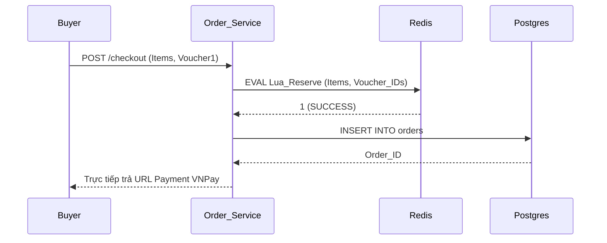

## UC-07: Webhook Thanh Toán Idempotency
**Activity Diagram**
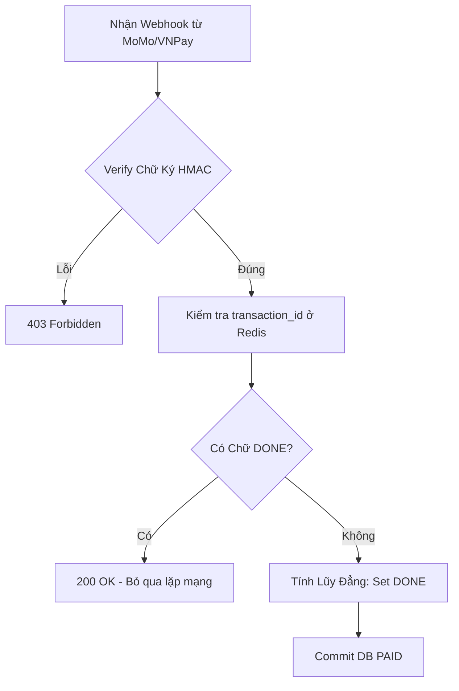

## UC-08: Theo dõi Hành trình (Tracking) & Push Notification
**Activity Diagram**
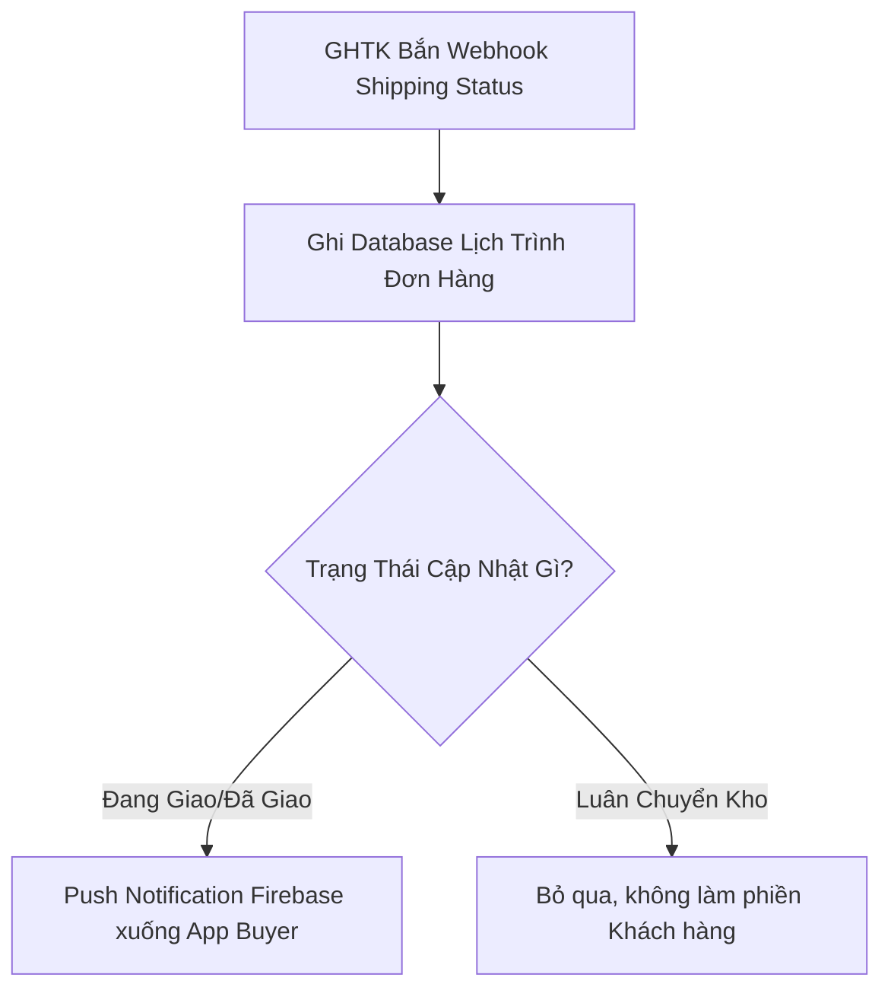

## UC-09: Request HOÀN TIỀN (RMA)
**Activity Diagram**
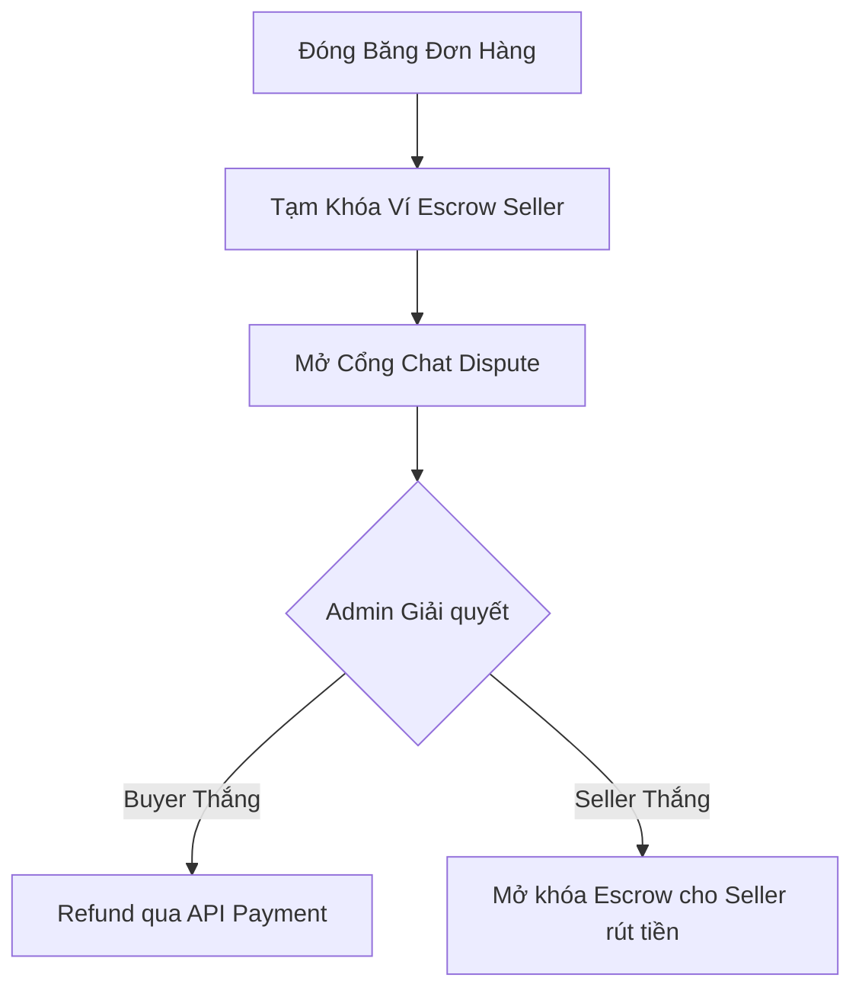
**Sequence Diagram**
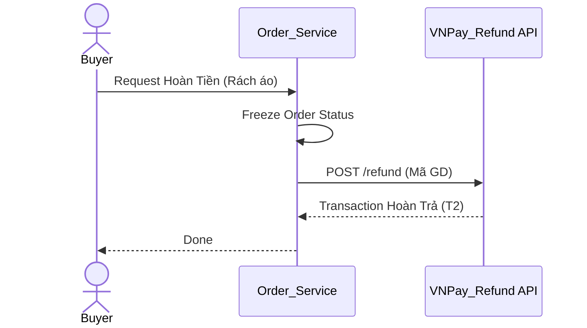

## UC-10: Đánh Giá Sản Phẩm (Text/Video)
**Activity Diagram**
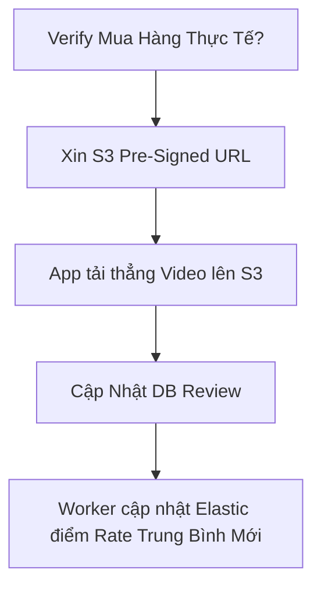
**Sequence Diagram**
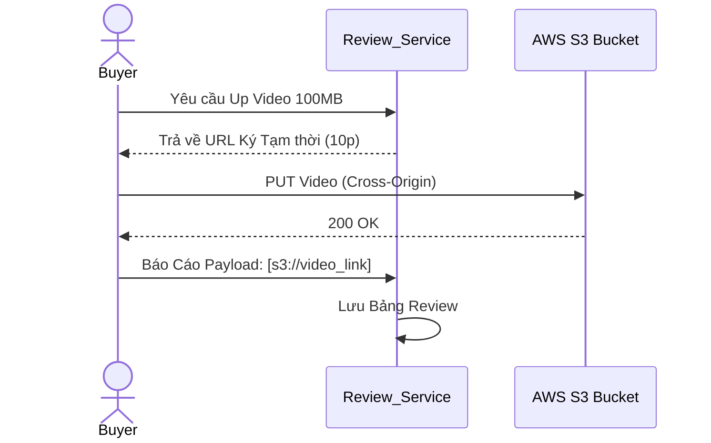

## UC-15: Chat WebSocket
**Activity Diagram**
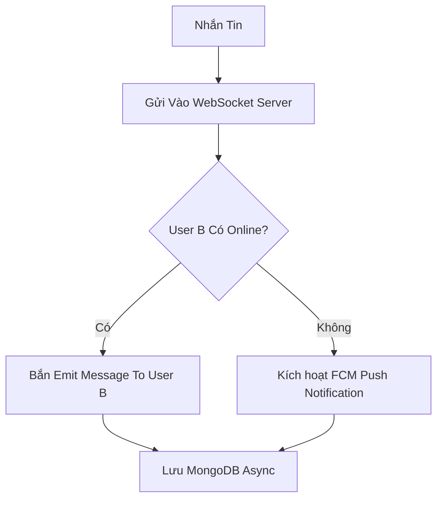

## UC-16: Loyalty Coins
**Activity Diagram**
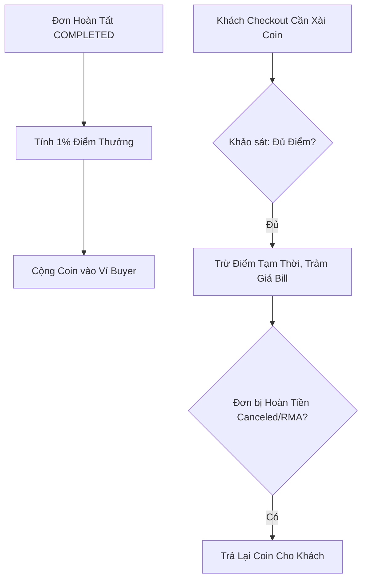

## UC-17: Gợi Ý Recommendation
**Activity Diagram**
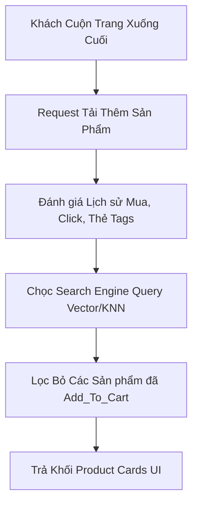
**Sequence Diagram**
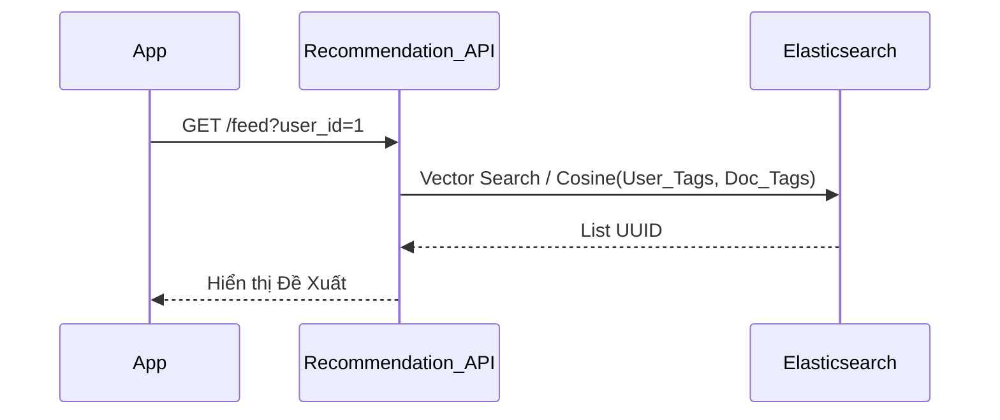
