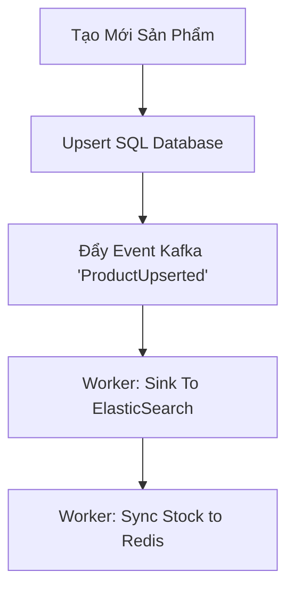
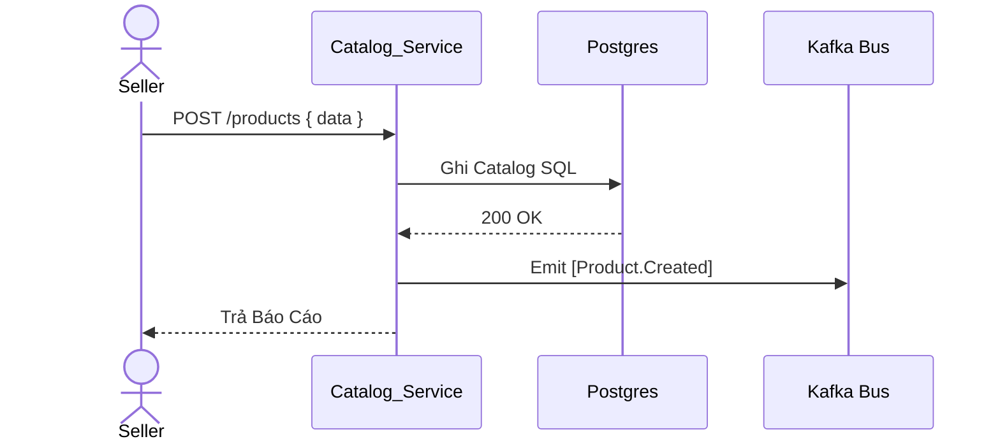
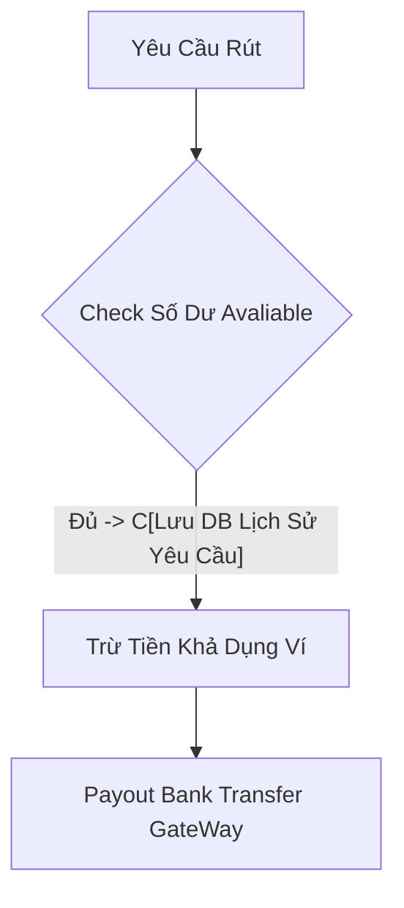
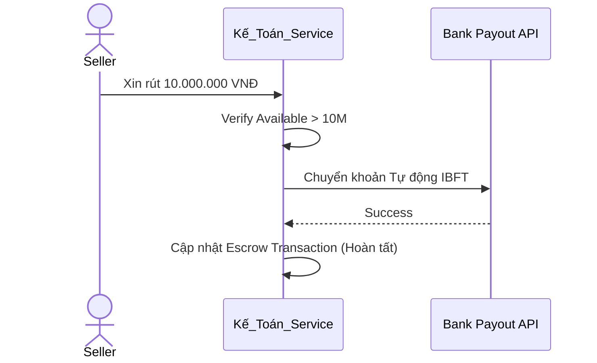
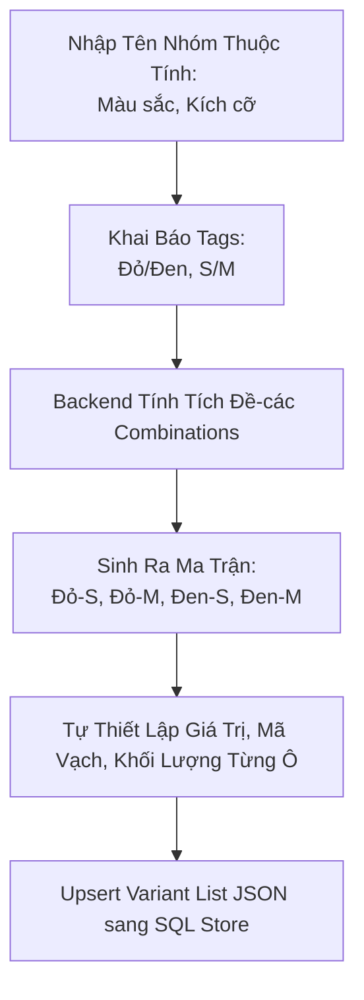
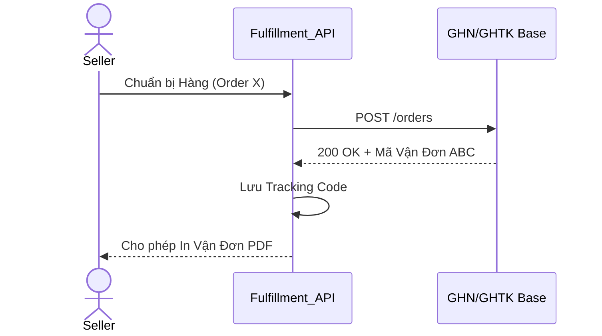
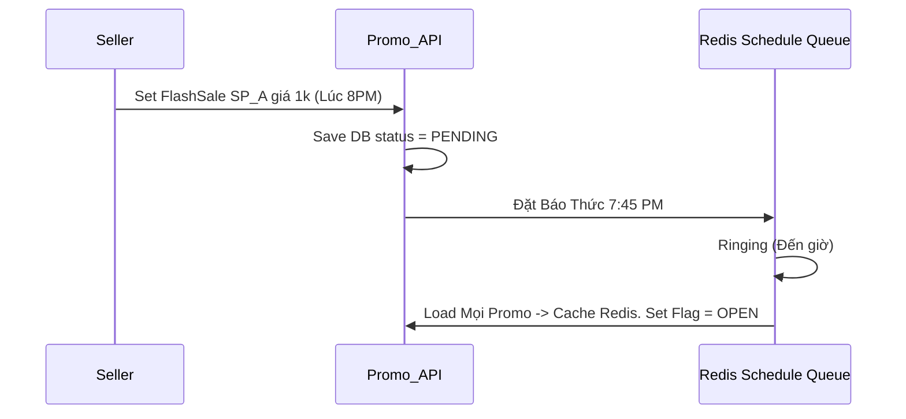
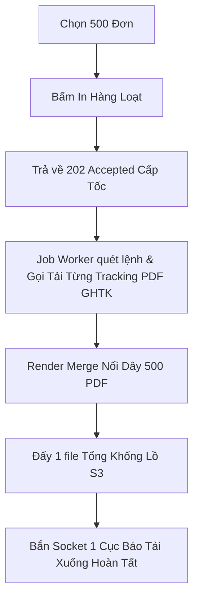
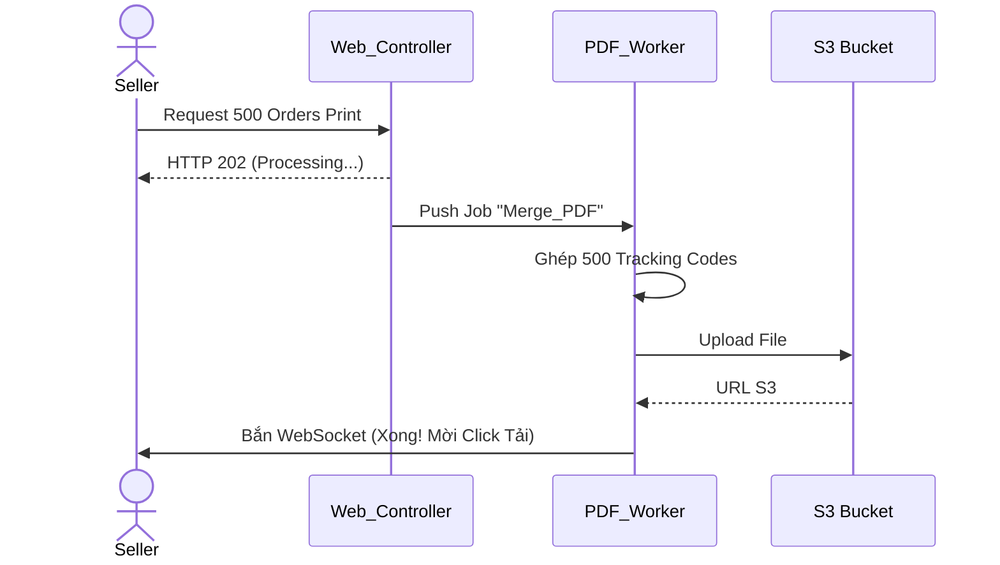

# Sequence & Activity - Nhóm 2: Seller

## UC-04: Quản trị Tồn kho & Đăng Sản Phẩm
**Activity Diagram**

**Sequence Diagram**


## UC-05: Rút tiền Ví Payout
**Activity Diagram**

**Sequence Diagram**


## UC-11: Quản Trị Matrix SKUs
**Activity Diagram**


## UC-12: Xử Lý Đóng Gói (Fulfillment)
**Activity Diagram**
```mermaid
flowchart TD
    A[Nhấn Đóng Gói Đơn A] --> B[Gọi API Đối tác GHTK] --> C{API Có Lỗi 500?}
    C -- Có --> D[Backoff Retry (10s, 30s)]
    C -- Không --> E[Nhận Tracking Code] --> F[Sinh file PDF Base64] --> G[Trả Lại Web]
```
**Sequence Diagram**


## UC-18: Thiết Lập Promotions (Sốc Giá)
**Activity Diagram**
```mermaid
flowchart TD
    A[Tạo Khuyến Mại \n(Ex: 8h tối)] --> B[Ghi DB \nStatus PENDING] --> C(Đợi Đến 7h45) --> D[Pre-warming Job chạy: \nĐẩy Cấu Hình Vào Redis] --> E(Đến 8h) --> F[Mở Bán Cache Giá Mới ở Redis]
```
**Sequence Diagram**


## UC-19: In Vận Đơn Hàng Loạt (Bulk)
**Activity Diagram**

**Sequence Diagram**

