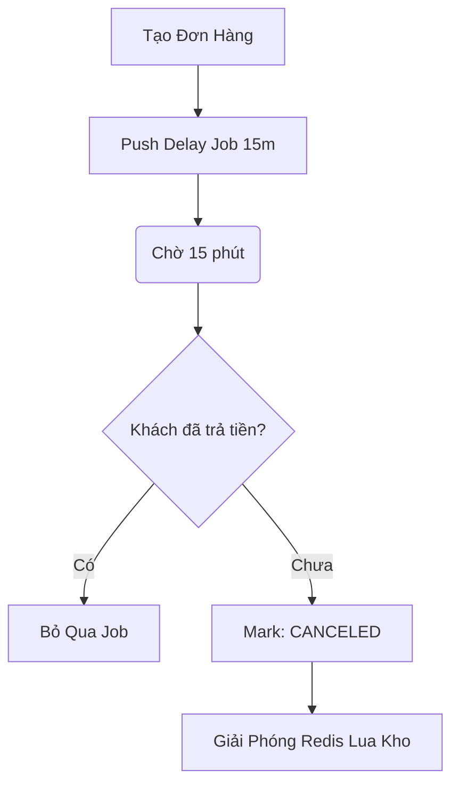
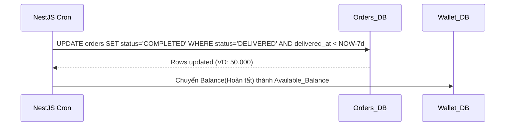
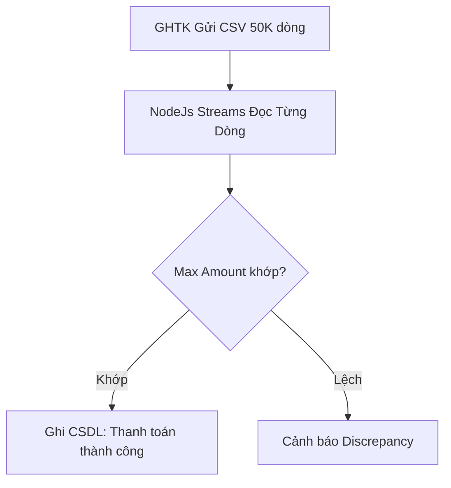
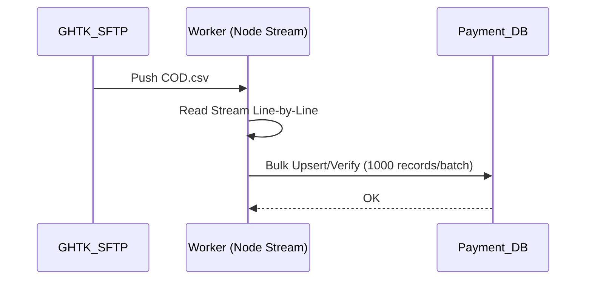

# Sequence & Activity - Nhóm 3: System / Background Jobs

## UC-13: Hủy Đơn Auto & Trả Tồn Kho (15 phút)
**Activity Diagram**

**Sequence Diagram**
*(Đã có sẵn tại file `core-sequences.md` gốc)*

## UC-14: Tự động Settlement (2:00 Hàng Ngày)
**Activity Diagram**
```mermaid
flowchart TD
    A[Cron: 2 AM] --> B[Quét Order > 7 Ngày (DELIVERED)]
    B --> C{Có Đang Tranh Chấp?}
    C -- Có --> D[Bỏ Qua Đơn Này]
    C -- Không --> E[Đổi sang COMPLETED] --> F[Tính & Trừ Phí Sàn] --> G[Tiền chảy vào Tạm ứng Seller]
```
**Sequence Diagram**


## UC-20: Affiliate & KOC Tracking
**Activity Diagram**
```mermaid
flowchart TD
    A[Click Affiliate Link] --> B[Lưu HTTPOnly Cookie: aff_id] --> C[Khách Đặt Hàng]
    C --> D[Ghim aff_id vào Order] --> E[Đơn COMPLETED(UC14)] --> F[Chia % Hoa Hồng cho KOC_ID]
```

## UC-21: Auto COD CSV Reconciliation
**Activity Diagram**

**Sequence Diagram**


## UC-22: Anti-Fraud Risk Engine
**Activity Diagram**
```mermaid
flowchart TD
    A[Khách Apply Voucher Sale 99K] --> B[Kéo Metadata (IP, GPS, Device Fingerprint)]
    B --> C{Logic Cày Mã?}
    C -- 10 Accounts Chung IP --> D[Mark FRAUD] --> E[Từ chối Order]
    C -- Normal --> F[Cho Phép Mua]
```
