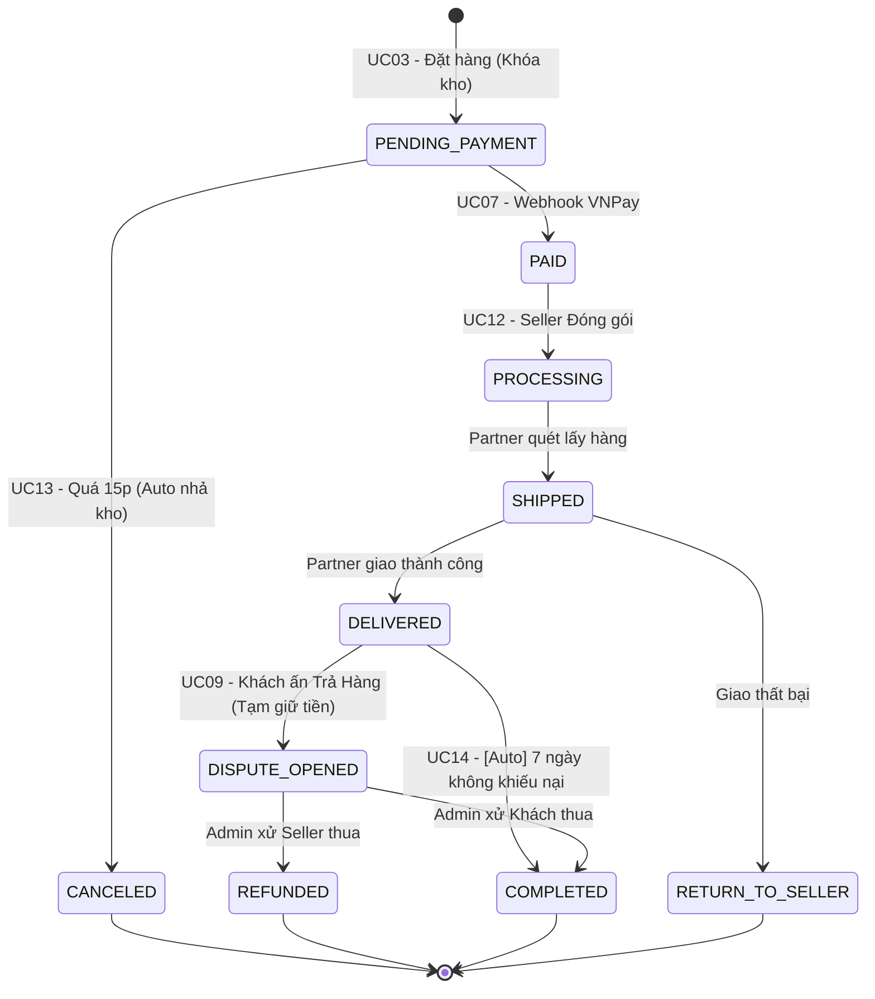
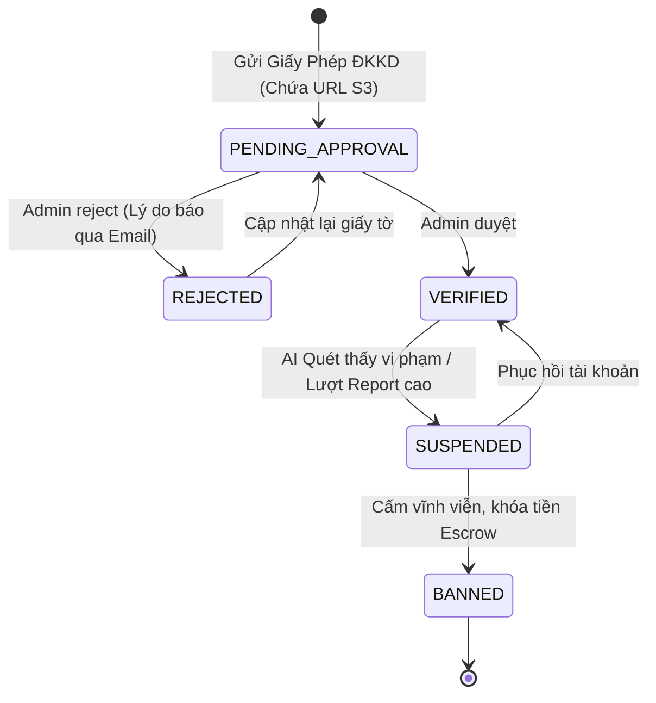
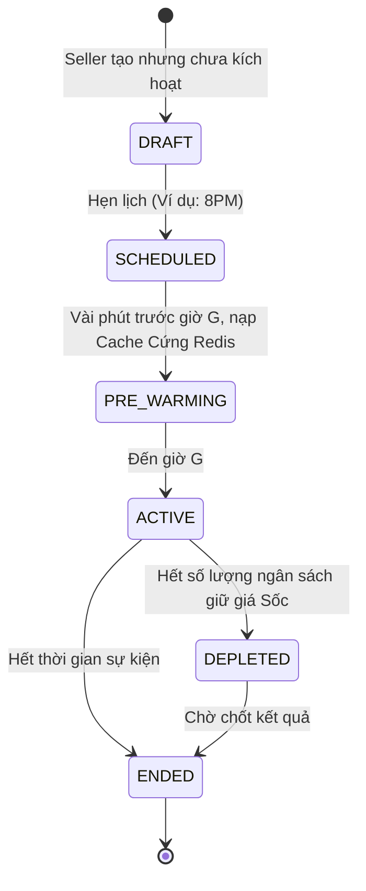
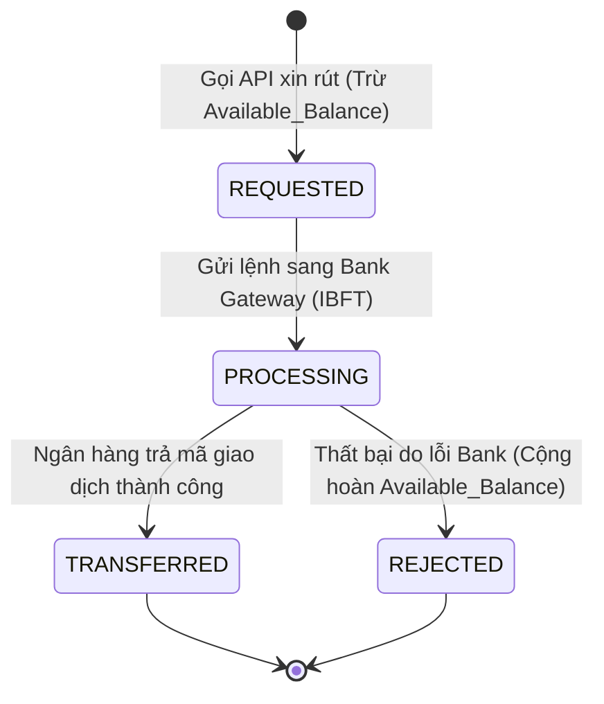

# Sơ đồ Trạng thái Đa mảng (State Machine Diagrams)

Tài liệu này thâu tóm biểu đồ vòng đời các thực thể cốt lõi, bao phủ toàn vẹn các nhánh rẽ và Use Cases hệ thống.

## 1. Vòng đời Đơn hàng (Cốt lõi E-Commerce) - Bao phủ UC03, UC07, UC09, UC12, UC13, UC14

## 2. Vòng đời Gian hàng (Store KYC) - Bao phủ UC00B
Quản trị vòng đời người bán để chống lừa đảo trên sàn giao dịch.

## 3. Vòng đời Khuyến mãi / Sốc giá (Seller Promotion) - Bao phủ UC18
Hạt nhân cho bài toán chịu tải Flash Sale (Caching tự động).

## 4. Vòng đời Xử lý Rút tiền Ví Escrow (Payout Request) - Bao phủ UC05
Quản trị rủi ro thất thoát tiền tệ.

