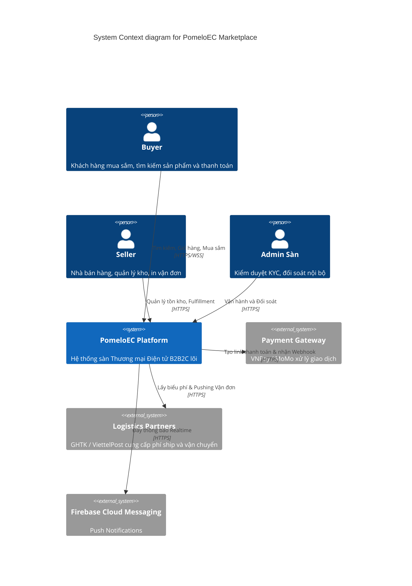
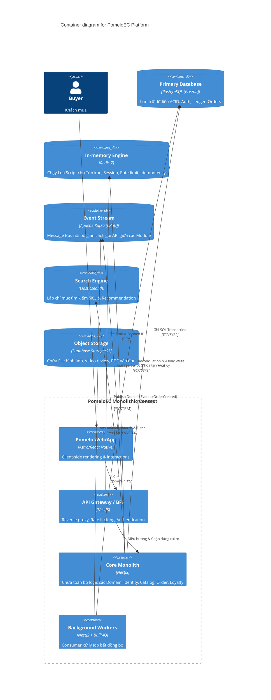

# Tổng quan Kiến trúc Hệ thống (System Overview)

Tài liệu này mô tả bức tranh vĩ mô của sàn thương mại điện tử **PomeloEC** bằng C4 Model. Kiến trúc chủ đạo là **Modular Monolith**, hướng đến mục tiêu chịu tải 10K TPS trong đợt kết hợp Flash Sale.

## 1. C4 - Context Diagram (Mức Ngữ cảnh)

Sơ đồ mô tả sự tương tác giữa Người dùng cuối (Buyer, Seller, Admin) với Hệ thống PomeloEC và các tích hợp phía bên ngoài (Cổng thanh toán, Hãng giao nhận).

## 2. C4 - Container Diagram (Mức Ứng dụng/Infrastructure)

Sơ đồ kiến giải cách mà Modular Monolith giao tiếp với CSDL Cơ bản và các bộ nhớ phân tán. Mặc dù là một Backend duy nhất (Node.js Process), nhưng bên dưới được chống lưng bởi dàn Data-store hạng nặng.

## 3. Kiến trúc Core Module (Logical Architecture)

Theo quy tắc **Domain-Driven Design (DDD)**, thư mục của Backend sẽ chia theo các Bounded Context (Không chia theo `controllers/`, `services/` truyền thống).

### Mạng lưới Modules:
1. **[IAM Module]:** Quản lý Identity, SSO, JWT, RBAC, KYC, Địa chỉ.
2. **[Catalog Module]:** Quản lý Danh mục, SKU Matrix, Brand. (Đồng bộ Kafka sang Elastic).
3. **[Inventory Module]:** Sinh tử lõi. Nắm giữ Logic khóa Tồn Kho (Redis Lua Script).
4. **[Cart & Checkout Module]:** Tính giá Rule Engine, Prorating Voucher, Tính Ship đối tác.
5. **[Order & Fulfillment Module]:** Quản lý State Machine đơn hàng. Giao tiếp Bulk Vận chuyển.
6. **[Payment Module]:** Đối soát tiền Escrow. Quản lý Idempotency.
7. **[Communication Module]:** Đẩy Socket, SMS, Push Notification.

## 4. Non-Functional Requirements (NFR) Fulfillment

* Làm sao để đạt **10,000 TPS** trong FlashSale?
  -> Chặn toàn bộ Read Traffic vào DB bằng Redis Caching. Mọi tương tác Checkout Write Traffic bị ép quy về **1 lệnh Call Atom Lua Script** trên Redis để trừ Tồn kho/Voucher. Lợi dụng I/O Single-Thread của Redis để chống 100% Race Condition.
* Hệ thống có sập dây chuyền (Cascading Failure) không?
  -> Không. Giao tiếp qua *Kafka* (Event-Driven). Order thành công chỉ đẩy mảng JSON vô Kafka. Việc gửi Email, trừ % Hoa hồng Affiliate (chạy cực chậm) sẽ do BullMQ Worker gánh nền bất đồng bộ.
