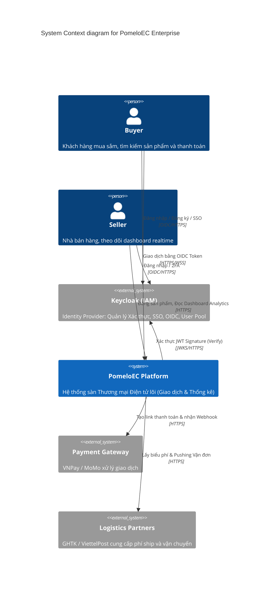
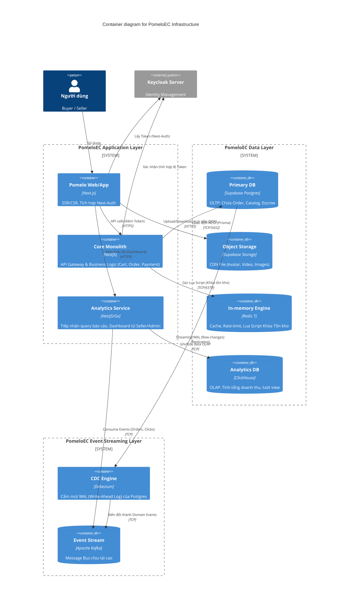

# Tổng quan Kiến trúc Hệ thống (Enterprise System Overview)

Tài liệu này mô tả bức tranh vĩ mô của sàn thương mại điện tử **PomeloEC** bằng C4 Model. Kiến trúc đã được nâng cấp lên chuẩn **Enterprise Modular Monolith + Decoupled Infrastructure**, định tuyến rõ ràng giữa hệ thống Giao dịch (OLTP) và Phân tích (OLAP), hướng đến mục tiêu chịu tải 10K TPS.

## 1. C4 - Context Diagram (Mức Ngữ cảnh)

Sơ đồ mô tả sự tương tác giữa Người dùng cuối với Hệ thống PomeloEC và khối Identity Provider riêng biệt (Keycloak).

## 2. C4 - Container Diagram (Luồng dữ liệu cấp Hạ tầng)

Sơ đồ kiến giải Data Pipeline và Event-Driven Architecture. NestJS đóng vai trò API Gateway & Business Logic, Supabase hứng dữ liệu hạt nhân, CDC bắt Log thời gian thực đẩy qua Kafka và chốt trạm tại ClickHouse.

## 3. Kiến trúc Luồng Dữ liệu Đặc Thù (CDC & CQRS)

Theo yêu cầu chuẩn Enterprise:
* **Chống Dual-Write**: Không còn tình trạng NestJS gọi `await db.save()` xong gọi tiếp `kafka.emit()`.
* Mọi hành động làm thay đổi CSDL tại Supabase Postgres sẽ được **Debezium (CDC)** bắt trọn ở tầng hệ điều hành (Log file) và vứt vào **Kafka** với tốc độ mili-giây.
* **CQRS ngầm định**: 
  - Lệnh **Write** (Tạo đơn, Trừ tiền) gọi thẳng vào NestJS ➔ Supabase Postgres.
  - Lệnh **Read báo cáo** (Xem doanh thu tuần, Phân tích Clickstream) gọi vào **Analytics Service** ➔ **ClickHouse** (Đã được đồng bộ từ Kafka). Đảm bảo tách bạch 100% Performance giữa việc Mua hàng và Xem báo cáo.

## 4. Quản lý Modules Chức Năng Cốt Lõi

1. **[IAM & Identity]:** ỦY QUYỀN TOÀN BỘ cho Keycloak.
2. **[Catalog Module]:** Quản lý Danh mục, SKU Matrix. Gắn Supabase Storage.
3. **[Inventory Module]:** Redis Lua Script nguyên tử đóng vai trò Thần giữ cửa (Gatekeeper).
4. **[Order & Payment Layer]:** Postgres Transaction. Hứng IPN VNPay/MoMo.
5. **[Analytics & Feed]:** Dịch vụ hoàn toàn cô lập, consume Kafka đẩy vô ClickHouse. Dùng cho trang Admin và Dashboard Thống kê Gian hàng.
