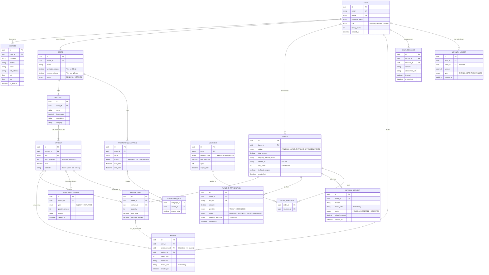

# Biểu Đồ Thực Thể Quan Hệ (ERD)

Tài liệu này cung cấp biểu diễn đồ họa của hệ thống cơ sở dữ liệu PostgreSQL cho PomeloEC, được sử dụng để hiểu sự liên kết ngữ nghĩa giữa các nhóm bảng.

## Giải Thích Chỉ Tên Khóa Ngoại Ràng Buộc (Constraints Explanation)

1. **Khóa liên kết `USER` -> `STORE`:**
   Một User thông thường sẽ không có Store. Quy trình đăng ký KYC (UC-00B) sẽ sinh ra bản ghi `STORE` dựa trên User đó và ép role sang `SELLER`.

2. **Cấu trúc `PRODUCT` vs `VARIANT`:**
   Sản phẩm (Product - VD: Áo Thun) là dữ liệu Abstract (Khung sườn hiển thị). Việc Bán (Tồn kho, Số lượng, SKU, Mã vạch) bắt buộc phải thao tác trên bảng `VARIANT` (Biến thể).

3. **Cấu trúc Vô hướng (Denormalization) của `ORDER_ITEM`:**
   Bảng `ORDER_ITEM` lưu lại toàn bộ ảnh chụp (Snapshot) của sản phẩm trong khoảnh khắc khách đặt mua (`quantity`, `unit_price`). Tuyệt đối không query join ngược lại bảng `VARIANT.price` khi tính tiền hay hiển thị Bill, vì giá sản phẩm trên `VARIANT` sau này có thể bị Shop thay đổi.
