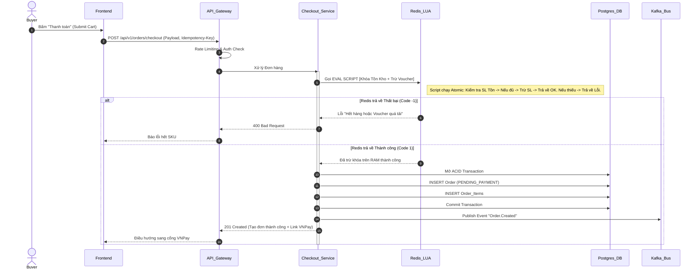
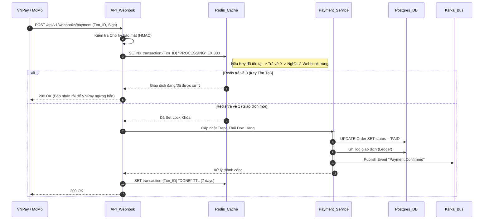
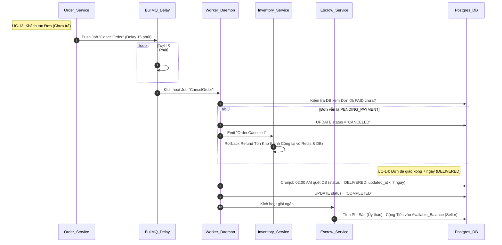

# LLD Biểu Đồ Trình Tự Lõi (Core Sequences)

Tài liệu này xác định các quy trình sống còn của nền tảng (Critical Paths) thông qua các Biểu đồ tuần tự (Sequence Diagrams), đảm bảo kỹ sư lập trình hiểu rõ luồng xử lý và chống bế tắc/race-condition.

## 1. UC-03: Luồng Checkout & Khóa Tồn Kho Bằng Redis (Flash Sale)

Quy trình này mô tả việc một người dùng gửi yêu cầu Checkout. Mục tiêu tối thượng của hệ thống là không được phép gọi CSDL PostgreSQL để kiểm tra tồn kho (Nút thắt cổ chai), mà phải xử lý nguyên tử qua Redis Lua Script.

## 2. UC-07: Xử Lý Webhook Lũy Đẳng (Idempotency Payment)

Do bản chất mạng lưới, Webhook của VNPay/MoMo có thể bắn về 2 lần cho cùng một giao dịch. Hệ thống bắt buộc phải chặn lại ở tầng Gate để tránh việc nhân đôi tiền, trạng thái sai lệch.

## 3. UC-13 & UC-14: Vòng Đời Tự Động Hóa (Auto-Cancel/Auto-Complete)

Trình tự thể hiện hệ thống Worker nền (BullMQ) quản lý các Task bị Delay (Hẹn giờ) cho các nghiệp vụ mà User không can thiệp.

