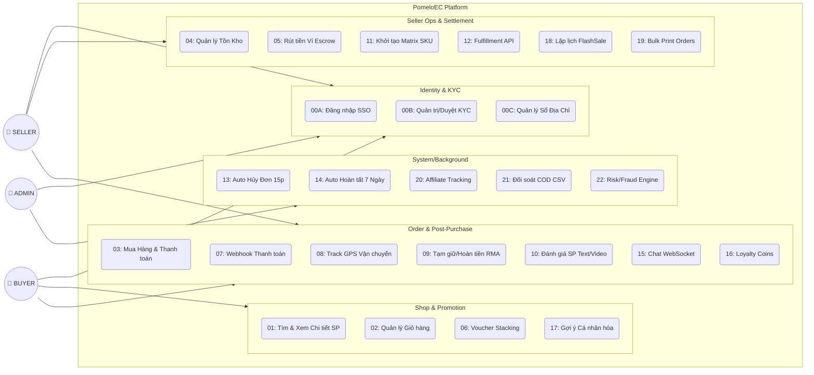
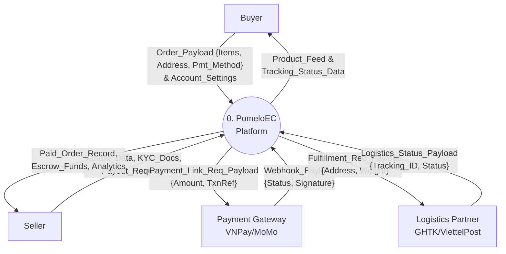
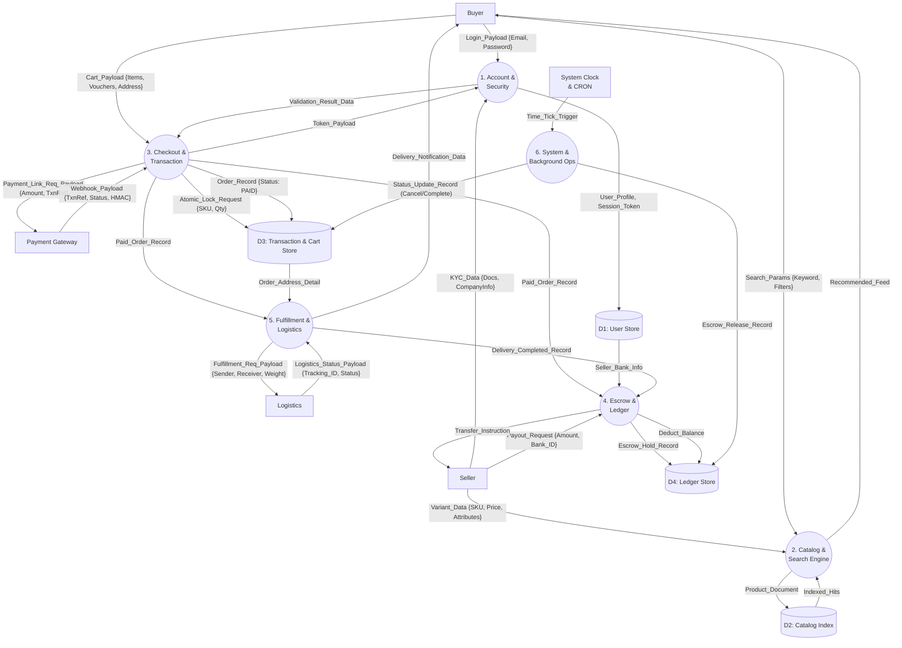
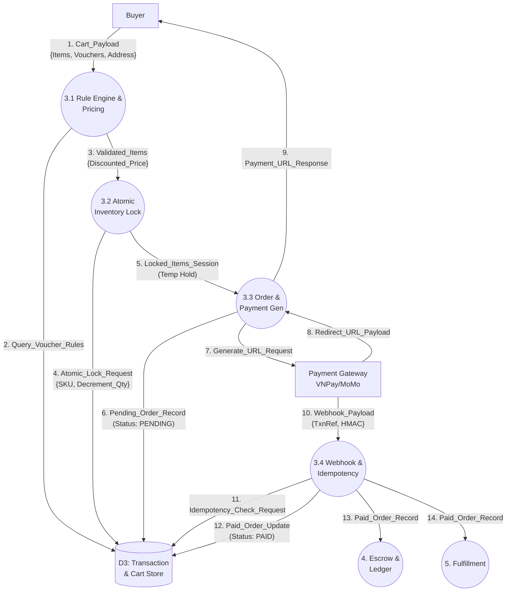

# Sơ đồ Data Flow Diagram (DFD) & Use Case Mapping

Tài liệu này cung cấp biểu diễn cho 100% Use Case của PomeloEC dưới góc nhìn Dòng chảy Dữ Liệu (Phân rã chức năng).

## 1. Sơ đồ Ranh Giới Hệ Thống (System Boundary Diagram) & Nhóm Use Cases

## 2. DFD Level 0 (Context Level Diagram)
Biểu diễn PomeloEC như một hộp đen duy nhất trao đổi Data với các Thực thể Ngoại vi.

## 3. DFD Level 1 (Phân rã Hệ thống Tổng thể)
Mổ xẻ bên trong Hộp đen PomeloEC thành các hệ thống con lớn quản trị dòng dữ liệu.

## 4. DFD Level 2 (Chi tiết Process P3: Checkout & Transaction)

Mổ xẻ bên trong Process `3.0 Checkout & Transaction` thành các quy trình con (Sub-processes) tuân thủ dữ liệu.

